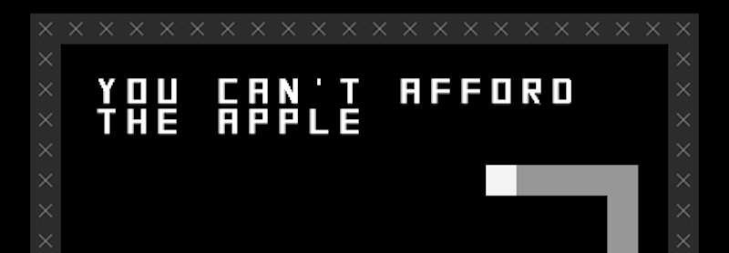

# *SNAKISMS*

## [Play Online](http://pippinbarr.github.io/SNAKISMS/) (desktop and mobile)

## Description
*Life is meaningless! Maybe you need some kind of ism to attempt to ward off the inevitable and unavoidable despair! Here, have some isms made of snakes! Life is still meaningless but now you have a bunch of snakes as well! Thank me later!*

*SNAKISMS* is an attempt to adapt the classic mobile-phone game *Snake* into a series of "philosophical positions." From a CAPITALISM version of the game to an EXISTENTIALIST version, and so on.

## Press
* chiconuclear, [Snakes on a Plato's Cave: SNAKISMS](http://www.anaitgames.com/articulos/snakisms-pippin-barr). Anait Games. (in Spanish)
* Pierrec, [Snakisms](http://oujevipo.fr/general/5895-snakisms/). L'Oujevipo. (in French)
* Clementine Spiler, [Snakisms, Philosophie en 8 Bits](http://www.novaplanet.com/novamag/70861/snakisms-philosophie-en-8-bits). Nova Planet. (in French)
* Jason Kottke, [Snakisms](http://kottke.org/17/03/snakisms). kottke.org.
* Cory Doctorow, [Snakisms: 22 philosophies expounded through the game of Snake](http://boingboing.net/2017/03/04/nothing-sounds-quite-like-a-33-2.html). BoingBoing.
* Clayton Purdom, [Waste some time playing 22 different philosophical versions of Snake](http://www.avclub.com/article/waste-some-time-playing-22-different-philosophical-251567). AV Club.
* Rob Beschizza, [Snakisms: the snake game, but now with meaning](http://boingboing.net/2017/03/06/snakisms-the-snake-game-but.html). BoingBoing.
* Chris Priestman, [SNAKISMS (Pippin Barr)](http://warpdoor.com/2017/03/07/snakisms-pippin-barr/). Warp Door.

Read the [Press Kit](../press) for press information

## Documentation
* Read the [Process Documentation](../process) for todos and design explorations
* Read the [Commit History](https://github.com/pippinbarr/snakisms/commits/master) for detailed, moment-to-moment insights into the development process
* Look at the [Code Repository](https://github.com/pippinbarr/snakisms) for source code etc.

## License
SNAKISMS is licensed under a [Creative Commons Attribution-NonCommercial 3.0 Unported License](http://creativecommons.org/licenses/by-nc/3.0/).
