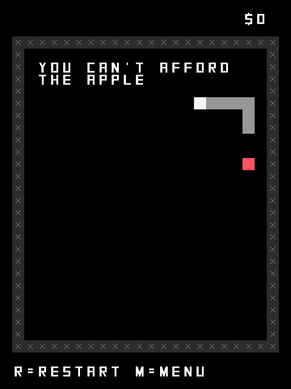
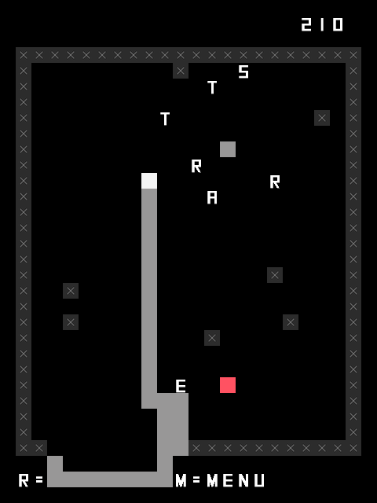
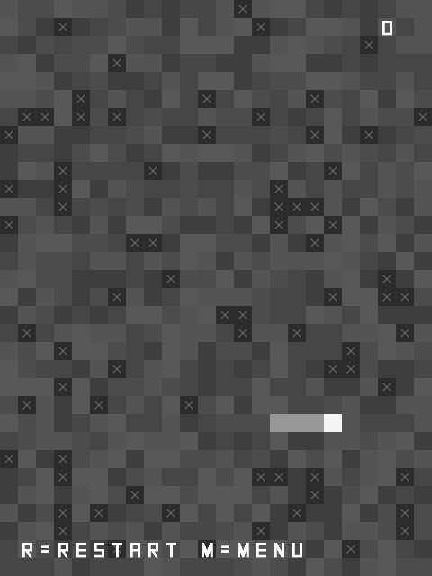
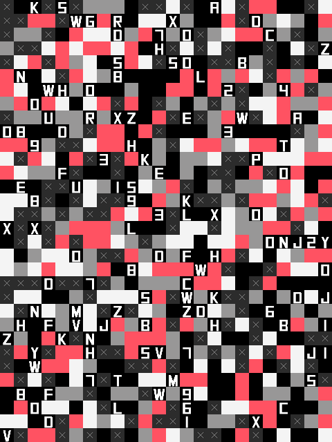
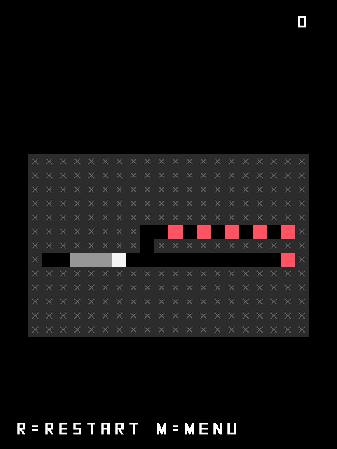

# *SNAKISMS* Press Kit

#### [Play *SNAKISMS*](https://pippinbarr.github.io/SNAKISMS/)

## The basics

* Developer: [Pippin Barr](http://www.pippinbarr.com/)
* Release: 25th of January, 2017
* Platform: Browser (mobile- and tablet-friendly)
* Code repository: https://www.github.com/pippinbarr/SNAKISMS/
* Price: $0.00

## Description

Life is meaningless! Maybe you need some kind of ism to attempt to ward off the inevitable and unavoidable despair! Here, have some isms made of snakes! Life is still meaningless but now you have a bunch of snakes as well! Thank me later!

## History

*SNAKISMS* was begun on the strength of the idea of "Ascetic Snake", a game of *Snake* in which the snake isn't meant to eat the apple (or whatever that thing is in *Snake*). That basic reversal of the standard form of the game struck me as funny because those sorts of things always strike me as funny, but on turning to actually make the game it seemed pretty clear it was too much of a throw-away idea all on its own.

And so it came to pass that I decided I needed to make a whole set of *Snake* games based (loosely) on different philosophies, eventually settling on the idea of "isms" because *SNAKISMS* is really a pretty great title for a game, I think you'll agree. The design process took a surprisingly long time in terms of coming up with a set of "reasonable" interpretations of philosophies/isms that could be translated in some way to the mechanics of the original *Snake* game.

This idea of multiple versions of a simple, retro arcade game is not especially new in my development history. In particular, *SNAKISMS* is a spiritual successor to the previous games [*PONGS*](http://www.pippinbarr.com/games/pongs/Pongs.html) and [*BREAKSOUT*](http://www.pippinbarr.com/games/breaksout/), each of which present 36 variations of their namesake game. *SNAKISMS* differs in that all the variations are much more closely tied to the specific thematic idea of philosophy and conveying it through game mechanics. (It's also the tragic case that there are only 21 variations in *SNAKISMS* because I couldn't or didn't want to come up with 36.)

## Technology

*SNAKISMS* is written in JavaScript using [Phaser](http://www.phaser.io/), an excellent JavaScript game library/engine. It also uses [phaser-swipe](https://github.com/flogvit/phaser-swipe) by Vegard Hanssen to implement swipe controls for the snake on touch-based devices. The sounds and graphics for *SNAKISMS* were all taken from the assets of my earlier game [*Snek.*](https://www.pippinbarr.com/2013/06/13/snek/). The music in the "Romanticism" variation is from the YouTube video [Royalty Free Creative Commons Music (Piano & Violin)](https://www.youtube.com/watch?v=TZTtvwpXReA).

*SNAKISMS* is an open source game licensed under a [Creative Commons Attribution-NonCommercial 3.0 Unported License](http://creativecommons.org/licenses/by-nc/3.0/). You are looking at the code (and process and press) repository right now.

## Features

* Snakes!
* Apples!
* Walls!
* Pseudo-philosophy!
* The consolation of pseudo-philosophy!

## Videos

### [SNAKISMS Trailer](https://www.youtube.com/watch?v=p9MS7ERVLGA)

## Images

     

## Press
* chiconuclear, [Snakes on a Plato's Cave: SNAKISMS](http://www.anaitgames.com/articulos/snakisms-pippin-barr). Anait Games. (in Spanish)
* Pierrec, [Snakisms](http://oujevipo.fr/general/5895-snakisms/). L'Oujevipo. (in French)
* Clementine Spiler, [Snakisms, Philosophie en 8 Bits](http://www.novaplanet.com/novamag/70861/snakisms-philosophie-en-8-bits). Nova Planet. (in French)
* Jason Kottke, [Snakisms](http://kottke.org/17/03/snakisms). kottke.org.
* Cory Doctorow, [Snakisms: 22 philosophies expounded through the game of Snake](http://boingboing.net/2017/03/04/nothing-sounds-quite-like-a-33-2.html). BoingBoing.
* Clayton Purdom, [Waste some time playing 22 different philosophical versions of Snake](http://www.avclub.com/article/waste-some-time-playing-22-different-philosophical-251567). AV Club.
* Rob Beschizza, [Snakisms: the snake game, but now with meaning](http://boingboing.net/2017/03/06/snakisms-the-snake-game-but.html). BoingBoing.
* Chris Priestman, [SNAKISMS (Pippin Barr)](http://warpdoor.com/2017/03/07/snakisms-pippin-barr/). Warp Door.

## Additional Links

* [Developer blog posts about *SNAKISMS*](http://www.pippinbarr.com/tag/snakisms?order=asc)

## Credits

* Pippin Barr: everything.

## Contact

* Email: [pippin.barr+press@gmail.com](mailto:pippin.barr+press@gmail.com)
* Website: [www.pippinbarr.com](http://www.pippinbarr.com/)
* Twitter: [@pippinbarr](https://www.twitter.com/pippinbarr)
* Facebook: [Pippin Barr](http://www.facebook.com/pippin.barr)
